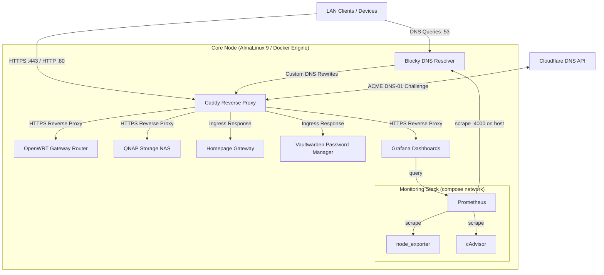

# Ansible Homelab Infrastructure Template

[](https://github.com/KrzysztofKaletkaDev/ansible-homelab-template/actions/workflows/lint.yml)

A production-grade, declarative **Infrastructure as Code (IaC)** template for automating core homelab services on Enterprise Linux (AlmaLinux / RHEL 9).

This project demonstrates an automated deployment of a containerized infrastructure stack featuring an internal DNS resolver with ad-blocking, a custom-compiled Caddy reverse proxy with automated Let's Encrypt TLS certificates via the Cloudflare DNS-01 challenge, a self-hosted password manager (Vaultwarden), a service dashboard (Homepage), and strict security isolation via Ansible Vault.

---

## 🏗 System Architecture



---

## 🚀 Key Features & Architectural Design

- **Infrastructure as Code (IaC):** Idempotent Ansible playbooks with modular, custom-crafted roles (`docker`, `blocky`, `caddy`, `monitoring`, `vaultwarden`, `homepage`).
- **Multi-Stage Container Compilation:** Custom-built Caddy Docker image using `xcaddy` to embed the Cloudflare DNS module for automated wildcard SSL certificate issuance (`*.domain.com`).
- **Automated ACME DNS-01 Challenge:** Automated SSL/TLS issuance without exposing HTTP ports to the public Internet.
- **Ad-Blocking & Privacy DNS:** Containerized Blocky DNS resolver with local DNS rewrites (`customDNS`) and external blocklists.
- **Self-Hosted Password Manager:** Vaultwarden (Bitwarden-compatible server) deployed behind Caddy, with no ports published directly — reachable only through the reverse proxy's internal Docker network.
- **Unified Service Dashboard:** Homepage, auto-discovering running containers via the Docker socket (read-only) and surfacing host resource stats.
- **Monitoring & Observability as Code:** Prometheus, Grafana, node_exporter and cAdvisor deployed behind Caddy. Grafana dashboards (datasources, providers, JSON panels) are provisioned entirely as code from Jinja2 templates with `allowUiUpdates: false` — not clicked together in the UI — and Prometheus collects host metrics, container metrics, and Blocky's own DNS metrics.
- **Enterprise DevSecOps Practices:** Strict separation of environment logic, topology, and encrypted secrets using Ansible Vault. Sensitive data is sanitized from version control via `.gitignore` patterns.
- **System Integration:** Automated configuration of system services (`systemd`), group privileges, and dynamic package repository resolution on Enterprise Linux.

---

## 📂 Repository Layout

```text
.
├── ansible.cfg                 # Global Ansible execution & privilege escalation settings
├── site.yml                    # Main infrastructure orchestration playbook
├── Vagrantfile                 # Disposable AlmaLinux 9 VM for testing site.yml before production
├── .gitignore                  # DevSecOps protection rules preventing secret leaks
├── .github/
│   └── workflows/
│       └── lint.yml            # CI: ansible-lint, yamllint, ansible-playbook --syntax-check on every PR
├── .pre-commit-config.yaml     # Local pre-commit hooks (ansible-lint + yamllint)
├── .ansible-lint                # ansible-lint rules/configuration
├── .yamllint                    # yamllint rules/configuration
├── requirements-dev.txt        # Python dev dependencies (ansible-lint, yamllint, ...)
├── collections/
│   └── requirements.yml        # Required Ansible Galaxy collections
├── inventory/
│   └── hosts.yml.example       # Node topology & IP mapping template
├── group_vars/
│   ├── all/
│   │   └── vars.yml.example    # Global infrastructure variables template
│   └── core_nodes/
│       └── vault.yml.example   # Encrypted secrets template (Ansible Vault)
└── roles/
    ├── docker/                 # Official Docker CE Engine & Compose Plugin installation
    ├── blocky/                 # Blocky DNS Resolver container deployment & configuration
    ├── caddy/                  # Custom Caddy Reverse Proxy deployment & xcaddy build
    ├── monitoring/              # Prometheus, node_exporter, cAdvisor & Grafana (dashboards as code)
    ├── vaultwarden/            # Vaultwarden (Bitwarden-compatible) password manager deployment
    └── homepage/               # Homepage service dashboard deployment & configuration
```

---

## 🛠 Deployment & Usage

### 1. Prerequisites

- **Control Node:** Linux workstation with `ansible-core` (2.15+) installed.
- **Target Host:** Machine running AlmaLinux 9 (or RHEL/Rocky Linux 9) with SSH access and sudo privileges.
- **Testing Environment (recommended):** Vagrant with a libvirt/KVM or VirtualBox provider. The included `Vagrantfile` spins up a disposable AlmaLinux 9 VM and runs the full `site.yml` playbook against it (`vagrant up` / `vagrant provision`), so role changes — especially anything touching `become: yes`, firewalld, or Docker image builds — can be validated before ever touching a production host.

### 2. Parameterization

Clone the repository and prepare your local configuration files from the provided templates:

```bash
git clone https://github.com/KrzysztofKaletkaDev/ansible-homelab-template.git
cd ansible-homelab-template

# Copy environment templates
cp inventory/hosts.yml.example inventory/hosts.yml
cp group_vars/all/vars.yml.example group_vars/all/vars.yml
cp group_vars/core_nodes/vault.yml.example group_vars/core_nodes/vault.yml
```

- Fill in target IP addresses in `inventory/hosts.yml`.
- Define your system username, domain, and internal network targets in `group_vars/all/vars.yml`.
- Put your Cloudflare API token in `group_vars/core_nodes/vault.yml` and encrypt it:

```bash
ansible-vault encrypt group_vars/core_nodes/vault.yml
```

### 3. Deploy

Apply the full infrastructure deployment:

```bash
ansible-playbook -i inventory/hosts.yml site.yml --ask-vault-pass
```

### 4. Continuous Integration

Every push and pull request triggers the [Lint workflow](.github/workflows/lint.yml): `ansible-lint`, `yamllint`, and an `ansible-playbook --syntax-check` run against `site.yml` with the example inventory/vars templates copied into place. This catches malformed roles and broken syntax before a change ever reaches a Vagrant VM or production host.

---

## 🔒 Security Principles Applied

- **Zero Secret Leakage:** `.gitignore` enforces strictly parameterized `.example` templates while excluding production variables and state files.
- **Least Privilege Enforcement:** Service configuration files generated on target nodes strictly enforce system permissions (`0644` for files, `0755` for directories, `0600` for any generated file embedding a Vault secret — e.g. Caddy's `docker-compose.yml` with the Cloudflare API token, and the monitoring stack's `docker-compose.yml` with the Grafana admin password).
- **No Unnecessary Host Exposure:** None of the monitoring containers (Prometheus, node_exporter, cAdvisor, Grafana) publish ports directly to the host — Grafana is reachable exclusively through Caddy over the internal `caddy-ingress` Docker network, the same isolation model used for Vaultwarden.
- **Encrypted State:** All API tokens and credentials stored within the repository structure are encrypted using AES-256 via Ansible Vault.

---

## 👨‍💻 Author

**Krzysztof** — Systems Administrator / Infrastructure Engineer

Focusing on Linux Systems Administration, Cloud Architectures, and Infrastructure Automation.
